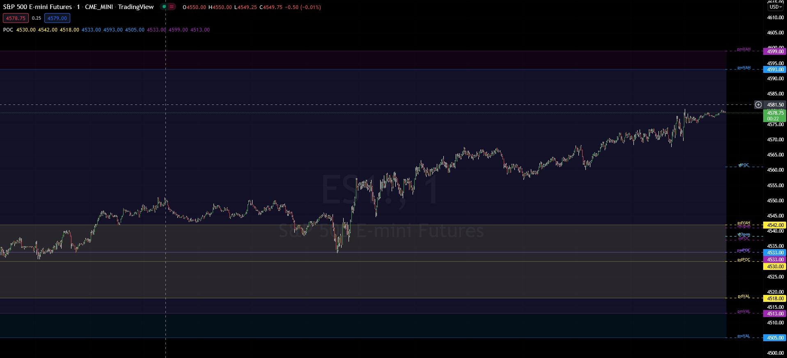
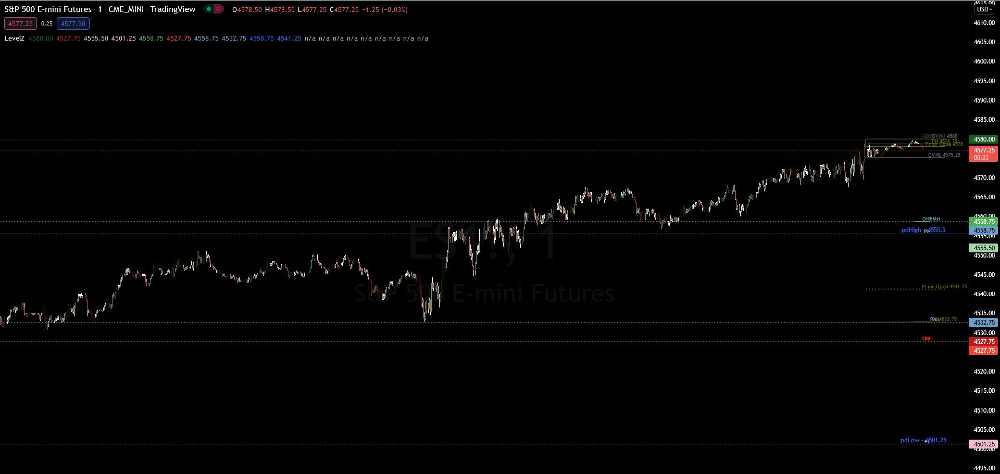

# Pinescript Storage

- 🔭 I’m currently working on creating tools for Interactive Brokers using python and ib_insync
- 👯 Collaboration on pinescript, trading ideas or strategies and trading software very welcome!
- 🤔 Working on Pinescript for Tradingview indicators.
- 💬 Please send me scripts you think will be useful for our group
- 📫 How to reach me: here or on discord BangerzNmash server
- 😄 Pronouns: we like anything but Mister... makes me feel old!  😄
- ⚡ Fun fact: On average a stock market correction happens every 2 years.  Last one was Mar 2020...

## Tradingview Indicators

POC
Displays Point of Control and Value Areas

CC Sessions
Displays various Market Sessions Asia, LSE, NYSE

LevelZ
Shows Previous Day (pd) levels and Over Night (ON) levels

